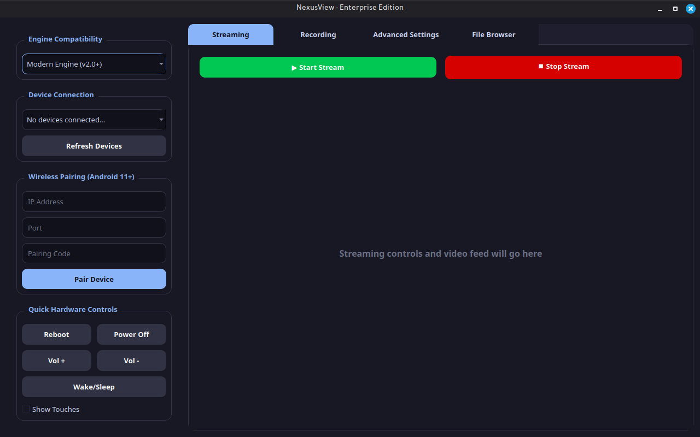

# NexusView

NexusView is a powerful GUI tool designed to manage `scrcpy` and `adb` with ease.

## Features
- User-friendly graphical interface.
- Full control over ADB tools.
- Screen recording and file management capabilities.

## Getting Started
1. Install the required dependencies:
   ```bash
   pip install -r requirements.txt
