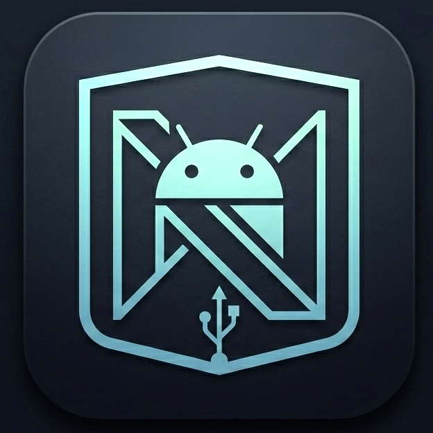
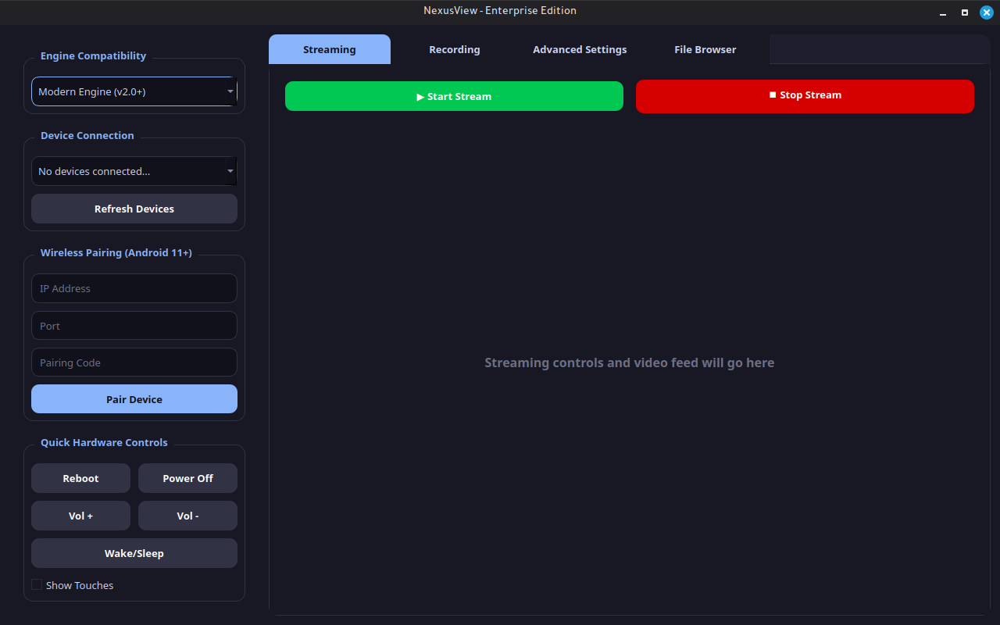

# NexusView

<p align="center">
  
</p>

<h1 align="center">NexusView</h1>

<p align="center">
  <b>A modern open-source Android management and screen mirroring GUI for Linux.</b>
</p>

<p align="center">


</p>

---

## 📖 About

**NexusView** is a powerful open-source GUI application built with **PyQt6** for Linux.

It provides a modern interface for interacting with **ADB (Android Debug Bridge)** and **scrcpy**, making Android device management, debugging, and screen mirroring easier, faster, and more efficient.

Designed for developers, Android enthusiasts, and power users who want a clean desktop experience without relying heavily on terminal commands.

---

## ✨ Features

- 📱 Real-time Android screen mirroring using **scrcpy**
- ⚡ Fast and responsive device control
- 🛠 Easy ADB command management
- 📦 Installed application management
- 🔍 Device monitoring and debugging utilities
- 🎨 Modern and intuitive PyQt6 interface
- 🐧 Optimized specifically for Linux
- 🤖 Workflow automation for repetitive Android tasks

---

## 📸 Preview

<p align="center">
  
</p>

---

## 🛠 Tech Stack

| Technology | Purpose |
|---|---|
| Python 3 | Core programming language |
| PyQt6 | GUI framework |
| ADB | Android device communication |
| scrcpy | High-performance screen mirroring |

---

## 📥 Installation

### 1️⃣ Clone the repository

```bash
git clone https://github.com/eljattarii/NexusView.git
cd NexusView
```

---

### 2️⃣ Create a virtual environment (Recommended)

```bash
python3 -m venv venv
source venv/bin/activate
```

---

### 3️⃣ Install Python dependencies

```bash
pip install -r requirements.txt
```

---

### 4️⃣ Install ADB and scrcpy

#### Ubuntu / Debian

```bash
sudo apt update
sudo apt install adb scrcpy
```

#### Arch Linux

```bash
sudo pacman -S android-tools scrcpy
```

#### Fedora

```bash
sudo dnf install android-tools scrcpy
```

---

## ▶️ Run the Application

```bash
python3 main.py
```

---

## 🚧 Planned Features

- Wireless ADB support
- APK installer
- File manager
- Device performance monitor
- Multi-device support
- Custom scrcpy settings
- Dark/Light themes
- Plugin system

---

## 🤝 Contributing

Contributions are welcome and greatly appreciated.

1. Fork the repository

2. Create a new branch

```bash
git checkout -b feature/amazing-feature
```

3. Commit your changes

```bash
git commit -m "Add amazing feature"
```

4. Push to GitHub

```bash
git push origin feature/amazing-feature
```

5. Open a Pull Request

---

## 📝 License

Distributed under the MIT License.

See the `LICENSE` file for more information.

---

## 👨‍💻 Author

### Anas El Jattari

- GitHub: https://github.com/eljattarii

---

<p align="center">
  Made with ❤️ using Python & PyQt6
</p>
